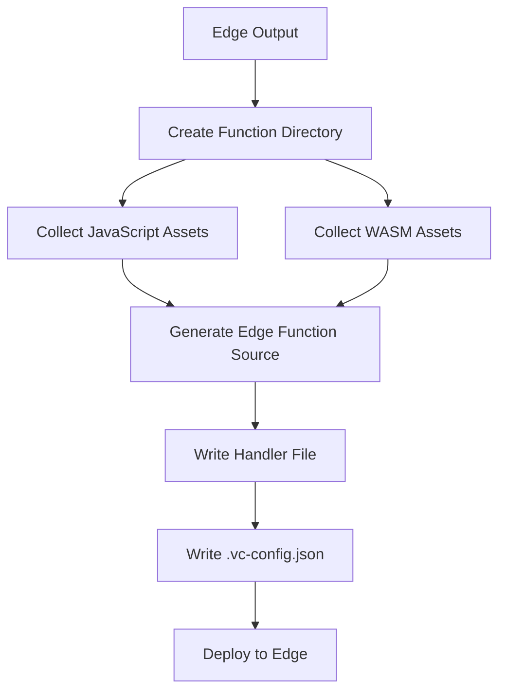

The Edge Runtime allows your Next.js application to run on Vercel's global edge network, providing low-latency responses by executing code close to your users.

## What runs on Edge Runtime

The adapter handles two types of Edge Runtime outputs:

1. **Edge functions**: Route handlers and pages configured with `export const runtime = 'edge'`
2. **Edge middleware**: Middleware that runs before requests are processed

<Info>
  Edge Runtime functions are identified by `output.runtime === 'edge'` in the adapter's processing logic (`index.ts:109-111`).
</Info>

## Edge function structure

Edge functions use a simplified request/response interface based on Web APIs:

```typescript
type EdgeFunction = (
  request: Request,
  context: { waitUntil(promise: Promise<unknown>): void }
) => Promise<Response>
```

This is defined in `get-edge-function.ts:26-29` and matches Vercel's Edge Runtime specification.

## Build process

When processing Edge outputs, the adapter creates a complete function bundle (`outputs.ts:665-786`):



### 1. Asset collection

The adapter separates assets by type (`outputs.ts:697-717`):

```typescript
const files: Record<string, string> = {};
const nonJsAssetFiles: Array<{ name: string; path: string }> = [];

for (const [relPath, fsPath] of Object.entries(output.assets)) {
  if (jsRegex.test(fsPath)) {
    files[relPath] = path.posix.relative(repoRoot, fsPath);
  } else {
    files[`assets/${relPath}`] = path.posix.relative(repoRoot, fsPath);
    nonJsAssetFiles.push({ name: relPath, path: `assets/${relPath}` });
  }
}

for (const [name, fsPath] of Object.entries(output.wasmAssets || {})) {
  files[`wasm/${name}.wasm`] = path.posix.relative(repoRoot, fsPath);
}
```

### 2. Source generation

The adapter generates edge function source code that adapts Next.js's format to Vercel's (`get-edge-function-source.ts:19-47`):

```typescript
export async function getNextjsEdgeFunctionSource(
  filePaths: string[],
  params: NextjsParams,
  outputDir: string,
  wasm?: Record<string, string>
): Promise<Source>
```

<AccordionGroup>
  <Accordion title="Chunk concatenation">
    All JavaScript chunks are concatenated into a single source with a global `_ENTRIES` namespace:

    ```typescript
    const chunks = new ConcatSource(raw(`globalThis._ENTRIES = {};`));
    for (const filePath of filePaths) {
      chunks.add(raw(`\n/**/;`));
      chunks.add(await fileToSource(content, filePath, fullFilePath));
    }
    ```
  </Accordion>

  <Accordion title="WASM imports">
    WASM modules are imported at the top of the file:

    ```typescript
    function getWasmImportStatements(wasm: Record<string, string>) {
      return Object.entries(wasm)
        .filter(([name]) => name.startsWith('wasm_'))
        .map(([name]) => {
          const pathname = `/wasm/${name}.wasm`;
          return `const ${name} = require(${JSON.stringify(pathname)});`;
        })
        .join('\n');
    }
    ```
  </Accordion>

  <Accordion title="Function wrapper">
    The edge function template wraps the Next.js function to adapt its signature:

    ```javascript
    export default (function () {
      const module = { exports: {}, loaded: false };
      const fn = (function(module,exports) { /* template */ });
      fn(module, module.exports);
      return module.exports;
    }).call({}).default(params)
    ```
  </Accordion>
</AccordionGroup>

### 3. Configuration

Each edge function gets a `.vc-config.json` with deployment settings (`outputs.ts:761-782`):

```typescript
const edgeConfig: EdgeFunctionConfig = {
  runtime: 'edge',
  name: params.name,
  entrypoint: 'index.js',
  filePathMap: files,              // All required files
  assets: nonJsAssetFiles,         // Non-JS assets
  deploymentTarget: 'v8-worker',   // V8 isolate
  environment: output.config.env || {},
  regions: output.config.preferredRegion,
  framework: {
    slug: 'nextjs',
    version: nextVersion
  }
};
```

## Edge function template

The edge function template (`get-edge-function.ts:38-160`) provides:

### Request transformation

Extracts and normalizes request information:

```typescript
let pathname = new URL(request.url).pathname;

// Remove basePath
if (params.nextConfig?.basePath) {
  if (pathname.startsWith(params.nextConfig.basePath)) {
    pathname = pathname.replace(params.nextConfig.basePath, '') || '/';
  }
}

// Remove locale prefix
if (params.nextConfig?.i18n) {
  for (const locale of params.nextConfig.i18n.locales) {
    const regexp = new RegExp(`^/${locale}($|/)`, 'i');
    if (pathname.match(regexp)) {
      pathname = pathname.replace(regexp, '/') || '/';
      break;
    }
  }
}
```

### Page matching

Determines which page will handle the request (`get-edge-function.ts:74-106`):

```typescript
const staticRoutes = params.staticRoutes.map((route) => ({
  regexp: new RegExp(route.namedRegex!),
  page: route.page
}));

const dynamicRoutes = params.dynamicRoutes?.map((route) => ({
  regexp: new RegExp(route.namedRegex!),
  page: route.page
})) || [];

// Check static routes first
for (const route of staticRoutes) {
  if (route.regexp.exec(pathname)) {
    pageMatch.name = route.page;
    break;
  }
}

// Then check dynamic routes
if (!pageMatch.name) {
  for (const route of dynamicRoutes) {
    const result = route.regexp.exec(pathname);
    if (result) {
      pageMatch = {
        name: route.page,
        params: result.groups
      };
      break;
    }
  }
}
```

<Warning>
  Dynamic API routes (under `/api`) are only matched against other API routes to prevent incorrect matches.
</Warning>

### Geo and IP data

Edge functions receive geo-location and IP information from headers (`get-edge-function.ts:139-146`):

```typescript
geo: {
  city: header(request.headers, 'x-vercel-ip-city', true),
  country: header(request.headers, 'x-vercel-ip-country', true),
  latitude: header(request.headers, 'x-vercel-ip-latitude'),
  longitude: header(request.headers, 'x-vercel-ip-longitude'),
  region: header(request.headers, 'x-vercel-ip-country-region', true)
},
ip: header(request.headers, 'x-real-ip')
```

### Set-Cookie handling

Special handling for multiple `Set-Cookie` headers (`get-edge-function.ts:124-222`):

```typescript
if (headers['set-cookie'] && typeof headers['set-cookie'] === 'string') {
  headers['set-cookie'] = parseSetCookieHeader(headers['set-cookie']);
}
```

The parser correctly handles comma-separated cookie attributes without splitting individual cookies.

## Edge middleware

Middleware can run on either Edge or Node.js runtime. For edge middleware, the adapter:

1. Processes it as an edge function (`outputs.ts:801-809`)
2. Generates routes from middleware matchers (`outputs.ts:814-827`)
3. Sets `middlewarePath` and `middlewareRawSrc` on routes

```typescript
export async function handleMiddleware(
  output: AdapterOutput['MIDDLEWARE'],
  ctx: { /* config */ }
): Promise<RouteWithSrc[]> {
  if (output.runtime === 'edge') {
    await handleEdgeOutputs([output], ctx);
  }
  
  const routes: RouteWithSrc[] = [];
  for (const matcher of output.config.matchers || []) {
    routes.push({
      continue: true,
      src: matcher.sourceRegex,
      middlewarePath: output.pathname,
      middlewareRawSrc: matcher.source ? [matcher.source] : [],
      override: true
    });
  }
  return routes;
}
```

## Edge Runtime parameters

The adapter passes essential Next.js configuration to edge functions (`outputs.ts:729-741`):

```typescript
const params: NextjsParams = {
  name: output.id
    .replace(/\.rsc$/, '')
    .replace('_middleware', 'middleware')
    .replace(/^\//,  ''),
  staticRoutes: [],
  dynamicRoutes: [],
  nextConfig: {
    basePath: config.basePath,
    i18n: config.i18n
  }
};
```

<Note>
  The static and dynamic routes arrays are empty for individual route handlers but populated for middleware to enable page matching.
</Note>

## Edge Runtime limitations

The Edge Runtime has some constraints:

- **No Node.js APIs**: Cannot use `fs`, `path`, or other Node.js built-in modules
- **No native modules**: Cannot use native Node.js addons
- **Limited size**: Functions must be under the size limit (typically ~1MB compressed)
- **No dynamic code evaluation**: No `eval()` or `new Function()`
- **Stateless**: No shared state between invocations

<Info>
  For functions that need Node.js APIs, use `export const runtime = 'nodejs'` instead.
</Info>

## Deployment target

Edge functions deploy to V8 isolates:

```typescript
deploymentTarget: 'v8-worker'
```

This provides:

- **Fast cold starts**: ~50ms or less
- **Global distribution**: Runs in Vercel's edge network
- **Automatic scaling**: Scales to handle traffic spikes
- **Cost efficiency**: Pay only for execution time

## Region configuration

You can configure preferred regions for edge functions:

```typescript
export const runtime = 'edge';
export const preferredRegion = 'iad1'; // US East
// or
export const preferredRegion = ['iad1', 'sfo1']; // Multiple regions
// or
export const preferredRegion = 'all'; // All edge regions
```

The adapter passes this to the function config (`outputs.ts:772`):

```typescript
regions: output.config.preferredRegion
```
