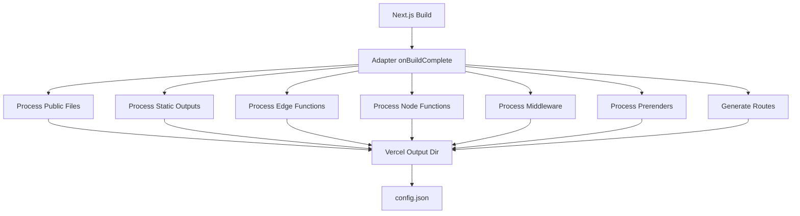

The Next.js Vercel Adapter transforms Next.js build outputs into Vercel's deployment format. It acts as a bridge between Next.js's build system and Vercel's infrastructure, handling everything from static files to serverless functions.

## Architecture overview

The adapter implements Next.js's `NextAdapter` interface and orchestrates the deployment process through a single main entry point: the `onBuildComplete` callback.



## Build process

The adapter's build process follows a specific order defined in `index.ts:26-940`:

### 1. Initialize output directory

The adapter creates a Vercel output directory structure:

```typescript
const vercelOutputDir = path.join(distDir, 'output');
await fs.mkdir(vercelOutputDir, { recursive: true });
```

### 2. Process static assets

<AccordionGroup>
  <Accordion title="Public files">
    Static files from the `public/` directory are copied to the output's `static/` folder with basePath handling (`outputs.ts:69-95`).
  </Accordion>

  <Accordion title="Static outputs">
    Automatically optimized pages and static files are processed with content-type overrides. HTML files get special handling to remove extensions in URLs (`outputs.ts:97-153`).
  </Accordion>
</AccordionGroup>

### 3. Classify runtime outputs

The adapter categorizes outputs by runtime (`index.ts:87-113`):

- **Node.js runtime**: Server-side rendered pages, API routes, and App Router routes
- **Edge runtime**: Edge functions and middleware running on Vercel's edge network

```typescript
for (const output of outputs) {
  if ('runtime' in output) {
    if (output.runtime === 'nodejs') {
      nodeOutputs.push(output);
    } else if (output.runtime === 'edge') {
      edgeOutputs.push(output);
    }
  }
}
```

### 4. Generate serverless functions

<Note>
  Both Node.js and Edge functions are created with deterministic configurations to enable function deduplication at the infrastructure level.
</Note>

The adapter generates function bundles in the `functions/` directory:

- **Node.js functions**: Include a launcher file (`___next_launcher.cjs`) that handles routing, locale detection, and dynamic route matching (`node-handler.ts:9-468`)
- **Edge functions**: Bundle JavaScript chunks with WASM imports and adapt them to Vercel's Edge Runtime signature (`get-edge-function-source.ts:19-57`)

### 5. Handle prerendering

Prerendered pages and Partial Prerendering (PPR) outputs are processed after functions (`index.ts:197-205`):

- Static HTML files with initial revalidation times
- Fallback pages for dynamic routes
- Postponed state for PPR pages
- Prerender configurations with cache settings

### 6. Generate routing configuration

The adapter creates a comprehensive routing configuration that includes (`index.ts:209-936`):

1. **Priority redirects** - User-defined redirects with priority
2. **i18n handling** - Locale detection and routing
3. **Headers** - Custom headers from `next.config.js`
4. **Middleware routes** - Middleware matchers and configuration
5. **Rewrites** - beforeFiles, afterFiles, and fallback rewrites
6. **Dynamic routes** - Pattern matching for dynamic segments
7. **Error handling** - 404 and 500 page routing

## Output structure

The final output directory structure:

```
.next/output/
├── config.json              # Vercel configuration with routes
├── static/                  # Static assets
│   ├── _next/static/       # Next.js static files
│   └── [public files]      # Files from public/ directory
└── functions/               # Serverless functions
    ├── [route].func/       # Function directories
    │   ├── .vc-config.json # Function configuration
    │   └── [handler files] # Runtime-specific handlers
    └── [route].prerender-config.json  # Prerender configs
```

## Configuration generation

The adapter generates a `config.json` file that Vercel uses to deploy your application (`index.ts:51-66`):

```typescript
const vercelConfig: VercelConfig = {
  version: 3,
  overrides: {},
  wildcard: i18nConfig?.domains ? [...] : undefined,
  images: getImagesConfig(config),
  routes: [...] // Generated routing rules
};
```

<Info>
  The `version: 3` indicates this uses Vercel's Build Output API v3 format.
</Info>

## Key implementation details

### Deterministic functions

To enable function deduplication, the adapter:

- Filters headers from the routes manifest (`outputs.ts:251-266`)
- Removes deployment IDs
- Creates deterministic file paths relative to the repo root

### Minimal mode

All functions run in "minimal mode" where Next.js:

- Loads prebuilt pages directly from the build output
- Skips build-time operations
- Uses provided route matching instead of filesystem checks

### Route matching

Node.js functions include route matching logic that:

1. Normalizes `_next/data` URLs
2. Strips RSC and segment prefetch suffixes
3. Handles locale detection
4. Matches against static and dynamic routes
5. Respects fallback:false configurations (`node-handler.ts:184-256`)

## Performance optimizations

The adapter uses several optimization techniques:

- **Parallel processing**: Uses semaphores to process outputs concurrently (`outputs.ts:109`)
- **Symlinks**: Creates symlinks for prerender functions to avoid duplication (`outputs.ts:521-534`)
- **Write-once**: Prevents duplicate writes with a locking mechanism (`outputs.ts:44-56`)
- **Asset deduplication**: Shares common assets across function bundles
