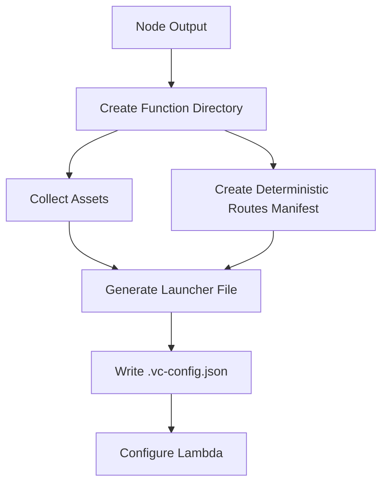

The Node.js runtime powers server-side rendering, API routes, and server components in your Next.js application. The adapter transforms these into optimized serverless functions for Vercel's infrastructure.

## What runs on Node.js runtime

The following Next.js outputs use Node.js runtime:

- **Pages Router**: Server-side rendered pages and API routes
- **App Router**: Server components, route handlers, and server actions
- **Server functions**: Any function with `export const runtime = 'nodejs'`

<Info>
  Node.js runtime is identified by `output.runtime === 'nodejs'` in the adapter (`index.ts:106-108`).
</Info>

## Node.js function structure

Node.js functions use the standard Node.js HTTP interface:

```typescript
type NodeHandler = (
  req: IncomingMessage,
  res: ServerResponse,
  internalMetadata: any
) => Promise<void>
```

This is implemented in the launcher file at `node-handler.ts:370-439`.

## Build process

The adapter creates Node.js functions with a deterministic structure (`outputs.ts:269-435`):



### 1. Function directory creation

Each route gets its own function directory (`outputs.ts:328-332`):

```typescript
const functionDir = path.join(
  functionsDir,
  `${normalizeIndexPathname(output.pathname, config)}.func`
);
await fs.mkdir(functionDir, { recursive: true });
```

The `normalizeIndexPathname` function ensures consistent naming:

- `/` becomes `/index`
- `/basePath` becomes `/basePath/index`

### 2. Asset bundling

The adapter collects all required assets relative to the repo root (`outputs.ts:334-361`):

```typescript
const files: Record<string, string> = {};

// Include page assets
for (const [relPath, fsPath] of Object.entries(output.assets)) {
  files[relPath] = path.posix.relative(repoRoot, fsPath);
}
files[path.posix.relative(repoRoot, output.filePath)] =
  path.posix.relative(repoRoot, output.filePath);

// For Pages Router, include 404 handler for not-found rendering
if (output.type === AdapterOutputType.PAGES) {
  const notFoundOutput = pages404Output || pagesErrorOutput;
  if (notFoundOutput) {
    for (const [relPath, fsPath] of Object.entries(notFoundOutput.assets)) {
      files[relPath] = path.posix.relative(repoRoot, fsPath);
    }
  }
}
```

<Note>
  The adapter uses relative paths from the repo root to enable function deduplication across monorepos.
</Note>

### 3. Launcher generation

The launcher file (`___next_launcher.cjs`) is generated with embedded logic for routing and rendering (`node-handler.ts:9-468`):

```javascript
process.env.NODE_ENV = 'production';
process.chdir(__dirname);

require('next/setup-node-env')

const _n_handler = (/* handler function */)();

module.exports = _n_handler;
module.exports.getRequestHandlerWithMetadata = (metadata) => {
  return (req, res) => _n_handler(req, res, metadata);
};
```

<Warning>
  The launcher file cannot use imports outside the function since it needs to be stringified entirely.
</Warning>

## Handler implementation

The Node.js handler performs several critical functions:

### Route matching

The handler matches incoming URLs to Next.js pages (`node-handler.ts:184-256`):

```typescript
function matchUrlToPage(urlPathname: string): {
  matchedPathname: string;
  locale?: string;
  matches?: RegExpMatchArray | null;
} {
  // 1. Normalize _next/data URLs
  urlPathname = normalizeDataPath(urlPathname);
  
  // 2. Strip RSC and segment prefetch suffixes
  for (const suffixRegex of [
    /\.segments(\/.*)\. segment\.rsc$/,
    /\.rsc$/
  ]) {
    urlPathname = urlPathname.replace(suffixRegex, '');
  }
  
  // 3. Extract locale
  const normalizeResult = normalizeLocalePath(
    urlPathname,
    i18n?.locales
  );
  urlPathname = normalizeResult.pathname;
  
  // 4. Match against routes
  const combinedRoutes = [...staticRoutes, ...dynamicRoutes];
  
  // Try literal match first
  for (const route of combinedRoutes) {
    if (route.page === urlPathname) {
      return {
        matchedPathname: inversedAppRoutesManifest[route.page] || route.page,
        locale: normalizeResult.locale
      };
    }
  }
  
  // Try regex match with fallback:false handling
  for (const route of combinedRoutes) {
    const matches = urlPathname.match(route.namedRegex);
    if (matches) {
      const fallbackFalseMap = prerenderFallbackFalseMap[route.page];
      if (fallbackFalseMap && !fallbackFalseMap.includes(urlPathname)) {
        continue; // Skip this route
      }
      return {
        matchedPathname: inversedAppRoutesManifest[route.page] || route.page,
        locale: normalizeResult.locale,
        matches
      };
    }
  }
}
```

### Data URL normalization

Pages Router `_next/data` URLs are normalized (`node-handler.ts:170-182`):

```typescript
function normalizeDataPath(pathname: string) {
  if (!(pathname || '/').startsWith('/_next/data')) {
    return pathname;
  }
  // /_next/data/BUILD_ID/page.json -> /page
  pathname = pathname
    .replace(/\/_next\/data\/[^/]{1,}/, '')
    .replace(/\.json$/, '');
    
  if (pathname === '/index') {
    return '/';
  }
  return pathname;
}
```

### Locale detection

For i18n applications, the handler detects and strips locale prefixes (`node-handler.ts:134-168`):

```typescript
function normalizeLocalePath(
  pathname: string,
  locales?: readonly string[]
): { pathname: string; locale?: string } {
  if (!locales) return { pathname };
  
  const lowercasedLocales = locales.map(locale => locale.toLowerCase());
  const segments = pathname.split('/', 2);
  
  if (!segments[1]) return { pathname };
  
  const segment = segments[1].toLowerCase();
  const index = lowercasedLocales.indexOf(segment);
  
  if (index < 0) return { pathname };
  
  const detectedLocale = locales[index];
  pathname = pathname.slice(detectedLocale.length + 1) || '/';
  
  return { pathname, locale: detectedLocale };
}
```

### Module loading

The handler dynamically loads the appropriate Next.js page module (`node-handler.ts:409-417`):

```typescript
const { matchedPathname: page, locale, matches } = matchUrlToPage(urlPathname);
const isAppDir = page.match(/\/(page|route)$/);

const mod = await require(
  './' + path.posix.join(
    relativeDistDir,
    'server',
    isAppDir ? 'app' : 'pages',
    `${page === '/' ? 'index' : page}.js`
  )
);

await mod.handler(req, res, {
  waitUntil: getRequestContext().waitUntil,
  requestMeta: {
    minimalMode: true,
    relativeProjectDir: '.',
    locale,
    initURL
  }
});
```

### App path normalization

App Router paths with route groups are normalized (`node-handler.ts:110-132`):

```typescript
const appPathRoutesManifest = require(
  './app-path-routes-manifest.json'
) as Record<string, string>;

// Maps /hello/(foo)/page -> /hello
const inversedAppRoutesManifest = Object.entries(
  appPathRoutesManifest
).reduce(
  (manifest, [originalKey, normalizedKey]) => {
    manifest[normalizedKey] = originalKey;
    return manifest;
  },
  {} as Record<string, string>
);
```

## Request context

Node.js functions access Vercel's request context for advanced features (`node-handler.ts:258-270`):

```typescript
const SYMBOL_FOR_REQ_CONTEXT = Symbol.for('@vercel/request-context');

function getRequestContext(): Context {
  const fromSymbol: typeof globalThis & {
    [SYMBOL_FOR_REQ_CONTEXT]?: { get?: () => Context };
  } = globalThis;
  return fromSymbol[SYMBOL_FOR_REQ_CONTEXT]?.get?.() ?? {};
}
```

This provides:

- **waitUntil**: Extend function execution for background tasks
- **headers**: Access to platform-specific headers

## Router server context

The handler sets up a global context for server-side operations (`node-handler.ts:272-356`):

```typescript
const RouterServerContextSymbol = Symbol.for(
  '@next/router-server-methods'
);

type RouterServerContext = Record<string, {
  render404?: (
    req: IncomingMessage,
    res: ServerResponse
  ) => Promise<void>;
}>;

routerServerGlobal[RouterServerContextSymbol]['.'] = {
  async render404(req, res) {
    // Try loading _not-found, 404, or _error page
    let mod;
    try {
      mod = await require('./server/app/_not-found/page.js');
    } catch {
      try {
        mod = await require('./server/pages/404.js');
      } catch {
        mod = await require('./server/pages/_error.js');
      }
    }
    res.statusCode = 404;
    await mod.handler(req, res, {
      waitUntil: getRequestContext().waitUntil
    });
  }
};
```

<Info>
  This context allows Next.js to render 404 pages without making network requests.
</Info>

## Function configuration

Each Node.js function has a `.vc-config.json` with Lambda settings (`outputs.ts:405-430`):

```typescript
const nodeConfig: NodeFunctionConfig = {
  filePathMap: files,                    // All required files
  operationType: 'PAGE' | 'API',        // Function type
  framework: {
    slug: 'nextjs',
    version: nextVersion
  },
  handler: '___next_launcher.cjs',      // Entry point
  runtime: 'nodejs20.x',                // Node.js version
  maxDuration: output.config.maxDuration,
  supportsMultiPayloads: true,          // Lambda invoke optimization
  supportsResponseStreaming: true,      // Streaming responses
  experimentalAllowBundling: true,      // Allow esbuild bundling
  useWebApi: false,                     // Use Node.js HTTP interface
  launcherType: 'Nodejs'
};
```

### Lambda optimizations

<AccordionGroup>
  <Accordion title="Multi-payload support">
    Allows the Lambda to handle multiple invocations within a single execution context, reducing cold starts.

    ```typescript
    supportsMultiPayloads: true
    ```
  </Accordion>

  <Accordion title="Response streaming">
    Enables streaming responses for better Time-To-First-Byte (TTFB) with React Server Components.

    ```typescript
    supportsResponseStreaming: true
    ```
  </Accordion>

  <Accordion title="Bundling">
    Allows Vercel to bundle the function with esbuild for smaller package sizes.

    ```typescript
    experimentalAllowBundling: true
    ```
  </Accordion>
</AccordionGroup>

## Deterministic functions

To enable deduplication, the adapter creates a deterministic routes manifest (`outputs.ts:251-266`):

```typescript
async function writeDeterministicRoutesManifest(distDir: string) {
  const manifest: RoutesManifest = require(
    path.join(distDir, 'routes-manifest.json')
  );
  
  // Remove non-deterministic fields
  manifest.headers = [];
  manifest.onMatchHeaders = [];
  delete manifest.deploymentId;
  
  const outputManifestPath = path.join(
    distDir,
    'routes-manifest-deterministic.json'
  );
  await fs.writeFile(outputManifestPath, JSON.stringify(manifest));
  return outputManifestPath;
}
```

<Note>
  This allows multiple routes that use the same page to share a single Lambda function.
</Note>

## Prerender functions

Prerendered pages get linked to their parent function using symlinks (`outputs.ts:508-534`):

```typescript
const parentFunctionDir = path.join(
  functionsDir,
  `${normalizeIndexPathname(parentNodeOutput.pathname, config)}.func`
);

const prerenderFunctionDir = path.join(
  functionsDir,
  `${normalizeIndexPathname(output.pathname, config)}.func`
);

if (output.pathname !== parentNodeOutput.pathname) {
  await fs.symlink(
    path.relative(
      path.dirname(prerenderFunctionDir),
      parentFunctionDir
    ),
    prerenderFunctionDir
  );
}
```

Each prerender also gets a `.prerender-config.json` (`outputs.ts:583-628`):

```typescript
{
  group: output.groupId,                // Revalidation group
  expiration: output.fallback?.initialRevalidate || 1,
  staleExpiration: output.fallback?.initialExpiration,
  sourcePath: parentNodeOutput?.pathname,
  passQuery: true,                      // Send query as params
  allowQuery: output.config.allowQuery, // Allowed query keys
  allowHeader: output.config.allowHeader,
  bypassToken: output.config.bypassToken,
  experimentalBypassFor: output.config.bypassFor,
  initialHeaders: { vary: varyHeader, ...output.fallback?.initialHeaders },
  initialStatus: output.fallback?.initialStatus,
  fallback: 'path/to/fallback.html',    // Static fallback
  chain: output.pprChain                // PPR chain config
}
```

## Middleware on Node.js

Middleware can also run on Node.js runtime (`outputs.ts:801-805`):

```typescript
if (output.runtime === 'nodejs') {
  await handleNodeOutputs([output], {
    ...ctx,
    isMiddleware: true
  });
}
```

The launcher detects middleware mode and loads the middleware module (`node-handler.ts:24-61`):

```typescript
if (ctx.isMiddleware) {
  return async function handler(request: Request): Promise<Response> {
    let middlewareHandler = await require(
      './' + path.posix.join(relativeDistDir, 'server', 'middleware.js')
    );
    middlewareHandler = middlewareHandler.handler || middlewareHandler;
    
    const context = getRequestContext();
    const response = await middlewareHandler(request, {
      waitUntil: context.waitUntil,
      requestMeta: { relativeProjectDir: '.' }
    });
    return response;
  };
}
```

<Info>
  Even though it runs on Node.js, middleware uses the Request/Response Web API instead of IncomingMessage/ServerResponse.
</Info>

## Node.js version

The adapter automatically detects the appropriate Node.js version (`outputs.ts:291`):

```typescript
const nodeVersion = await getNodeVersion(
  projectDir,
  undefined,
  {},
  {}
);

// Returns something like:
{
  runtime: 'nodejs20.x',
  discontinueDate: new Date('2026-04-30')
}
```

This respects:

- `.nvmrc` or `.node-version` files
- `engines.node` in `package.json`
- Default to latest LTS version

## Mojibake handling

The handler includes special handling for character encoding issues in headers (`node-handler.ts:358-368`):

```typescript
function fixMojibake(input: string): string {
  // Convert each character's char code to a byte
  const bytes = new Uint8Array(input.length);
  for (let i = 0; i < input.length; i++) {
    bytes[i] = input.charCodeAt(i);
  }
  
  // Decode the bytes as proper UTF-8
  const decoder = new TextDecoder('utf-8');
  return decoder.decode(bytes);
}

let urlPathname = typeof req.headers['x-matched-path'] === 'string'
  ? fixMojibake(req.headers['x-matched-path'])
  : undefined;
```

<Warning>
  This fixes UTF-8 encoding issues that can occur when headers pass through multiple proxies.
</Warning>

## Error handling

The handler includes comprehensive error handling (`node-handler.ts:432-438`):

```typescript
try {
  // ... handler logic
} catch (error) {
  console.error(`Failed to handle ${req.url}`, error);
  // Re-throw to allow global handler to decide how to handle
  throw error;
}
```

This allows Vercel's infrastructure to:

- Capture errors for monitoring
- Retry transient failures
- Serve custom error pages
