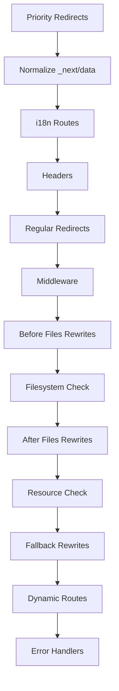

The adapter transforms Next.js routing configuration into Vercel's routing format, creating a comprehensive set of rules that handle everything from i18n to dynamic routes.

## Route generation process

Routes are generated in a specific order to ensure correct precedence (`index.ts:261-936`):



## Route types

The adapter processes several types of routes from Next.js configuration.

### Redirects

Redirects are extracted and categorized by priority (`routing.ts:176-211`):

```typescript
export function extractRedirects(routing: {
  beforeMiddleware: AdapterRoute[];
  beforeFiles: AdapterRoute[];
}): {
  priority: RouteWithSrc[];  // Redirects with continue: true
  normal: RouteWithSrc[];    // Standard redirects
}
```

**Priority redirects** use `continue: true` to allow subsequent routes to process, while **normal redirects** terminate routing.

<Note>
  Redirects are identified by status codes: 301, 302, 303, 307, or 308.
</Note>

### Rewrites

Rewrites allow URLs to be rewritten to different destinations without changing the browser URL. They're organized in three phases (`routing.ts:143-171`):

<AccordionGroup>
  <Accordion title="beforeFiles rewrites">
    Run before checking the filesystem. Marked with `override: true` to take precedence over static files.

    ```typescript
    beforeFiles: routing.beforeFiles
      .filter(isRewriteRoute)
      .map((item) => ({
        src: item.sourceRegex,
        dest: item.destination,
        continue: true,
        override: true
      }))
    ```
  </Accordion>

  <Accordion title="afterFiles rewrites">
    Run after checking the filesystem but before dynamic routes. Uses `check: true` to verify the destination exists.
  </Accordion>

  <Accordion title="fallback rewrites">
    Run as a last resort if no other routes match.
  </Accordion>
</AccordionGroup>

### Headers

Custom headers from `next.config.js` are extracted and applied with `continue: true` (`routing.ts:216-244`):

```typescript
export function extractHeaders(routing: {
  beforeMiddleware: AdapterRoute[];
  beforeFiles: AdapterRoute[];
}): RouteWithSrc[]
```

Headers with priority use `important: true` to ensure they're not overridden.

### Dynamic routes

Dynamic routes use regex patterns to match parameterized URLs (`index.ts:231-259`):

```typescript
for (const route of routing.dynamicRoutes) {
  dynamicRoutes.push({
    src: route.sourceRegex,      // e.g., "^/posts/(?<slug>[^/]+?)(?:/)?$"
    dest: route.destination,     // e.g., "/posts/[slug]"
    check: true,
    has: route.has,              // Conditional matching
    missing: route.missing
  });
}
```

## Routing handles

Vercel uses special "handle" routes to control routing flow:

| Handle | Purpose | Location |
|--------|---------|----------|
| `filesystem` | Check if static file exists | After beforeFiles rewrites |
| `resource` | Check for API routes and functions | After afterFiles rewrites |
| `miss` | Continue if no match found | Before error handling |
| `hit` | Match found, apply final headers | After dynamic routes |
| `rewrite` | Apply rewrite transformations | After fallback rewrites |
| `error` | Handle errors (404/500) | End of routing |

## Rewrite headers

For App Router with PPR, rewrites get special headers to preserve routing information (`routing.ts:10-124`):

```typescript
export function modifyWithRewriteHeaders(
  rewrites: RouteWithSrc[],
  {
    isAfterFilesRewrite = false,
    shouldHandleSegmentPrefetches
  }
)
```

These headers include:

- `x-nextjs-rewritten-path`: The original pathname before rewrite
- `x-nextjs-rewritten-query`: Query parameters from the rewrite

<Info>
  Internal Next.js query params (starting with `nxtP` or `nxtI`) are filtered out to avoid conflicts.
</Info>

## i18n routing

For applications with internationalization, the adapter generates routes for (`index.ts:282-420`):

### Locale detection

Automatic locale detection based on headers and cookies:

```typescript
{
  src: '/',
  locale: {
    redirect: {
      en: '/',
      de: '/de',
      fr: '/fr'
    },
    cookie: 'NEXT_LOCALE'
  },
  continue: true
}
```

### Domain-based locales

Redirect users to locale-specific domains:

```typescript
locale: {
  redirect: {
    de: 'https://example.de/',
    fr: 'https://example.fr/'
  },
  cookie: 'NEXT_LOCALE'
}
```

### Default locale handling

Routes to strip and add default locale prefixes:

```typescript
// Remove locale prefix for default locale
{
  src: '^/basePath/en/(.*)$',
  dest: '/basePath/$1',
  check: true
}

// Add default locale when missing
{
  src: '^/basePath/(.*)$',
  dest: '/basePath/en/$1',
  continue: true
}
```

## Middleware routing

Middleware routes are generated from middleware matchers (`outputs.ts:814-827`):

```typescript
for (const matcher of output.config.matchers || []) {
  const route: RouteWithSrc = {
    continue: true,
    src: matcher.sourceRegex,
    has: matcher.has,
    missing: matcher.missing,
    middlewarePath: output.pathname,
    middlewareRawSrc: matcher.source ? [matcher.source] : [],
    override: true
  };
  routes.push(route);
}
```

<Warning>
  Middleware routes use `override: true` to ensure they run before file system checks.
</Warning>

## Next.js data routes

For Pages Router with middleware, `_next/data` URLs require special handling (`routing.ts:246-318`):

### Normalization

Strip the `_next/data` prefix and `.json` extension:

```typescript
export function normalizeNextDataRoutes(
  config: NextConfig,
  buildId: string,
  shouldHandleMiddlewareDataResolving: boolean
): RouteWithSrc[]
```

Example transformation:
```
/_next/data/BUILD_ID/posts/hello.json → /posts/hello
```

### Denormalization

After processing, convert back to data URLs (`routing.ts:337-392`):

```typescript
export function denormalizeNextDataRoutes(
  config: NextConfig,
  buildId: string,
  shouldHandleMiddlewareDataResolving: boolean
): RouteWithSrc[]
```

Example transformation:
```
/posts/hello → /_next/data/BUILD_ID/posts/hello.json
```

## RSC and prefetch routing

App Router requires special routes for React Server Components (`index.ts:500-598`):

### RSC requests

Routes that detect and rewrite RSC requests:

```typescript
{
  src: '^/basePath/((?!.+\\.rsc).+?)(?:/)?$',
  has: [{
    type: 'header',
    key: 'RSC',
    value: '1'
  }],
  dest: '/basePath/$1.rsc',
  headers: { vary: 'RSC, Next-Router-State-Tree' },
  continue: true,
  override: true
}
```

### Segment prefetching

For PPR, segment prefetch requests are routed to special files:

```typescript
{
  src: '/(?<path>.+?)(?:/)?$',
  dest: '/$path.segments/$segmentPath.segment.rsc',
  has: [
    { type: 'header', key: 'RSC', value: '1' },
    { type: 'header', key: 'Next-Router-Prefetch', value: '1' },
    { type: 'header', key: 'Next-Segment-Prefetch', value: '/(?<segmentPath>.+)' }
  ],
  continue: true,
  override: true
}
```

## Conditional routing

Routes can conditionally match based on headers, cookies, or query parameters:

### Has conditions

```typescript
{
  src: '/api/feature',
  dest: '/api/feature-v2',
  has: [
    { type: 'header', key: 'x-feature-flag', value: 'enabled' },
    { type: 'cookie', key: 'beta-user', value: 'true' }
  ]
}
```

### Missing conditions

```typescript
{
  src: '/api/endpoint',
  status: 404,
  missing: [
    { type: 'header', key: 'x-api-key' }
  ]
}
```

## Error handling routes

The adapter generates routes for 404 and 500 errors (`index.ts:433-489`, `846-935`):

```typescript
// 404 handling
{
  src: '/.*',
  dest: '/_not-found',  // or '/404' or '/_error'
  status: 404
}

// 500 handling
{
  src: '/.*',
  dest: '/500',  // or '/_error'
  status: 500
}
```

<Info>
  The adapter automatically detects which error pages exist and generates appropriate routes.
</Info>

## Route debugging

To debug routing issues, examine the generated `config.json`:

```bash
cat .next/output/config.json | jq '.routes'
```

This shows the exact order and configuration of all routing rules.
